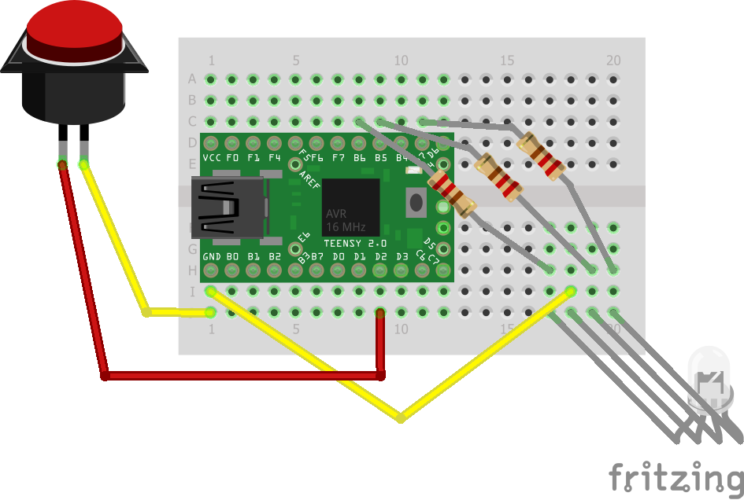

# Teensy Panic button
Lock a windows PC using an arcade button.
Just playing around

## Hardware
See Fritzing design in docs folder

### part list
* Teensy 2.0
* USB cable to connect Teensy to PC
* RGB led
* Red arcade button
* small breadboard
* 5 wires
* 4 220 Ohm resistors
* (cardboard) box

## Software
Running code panic_button_2
